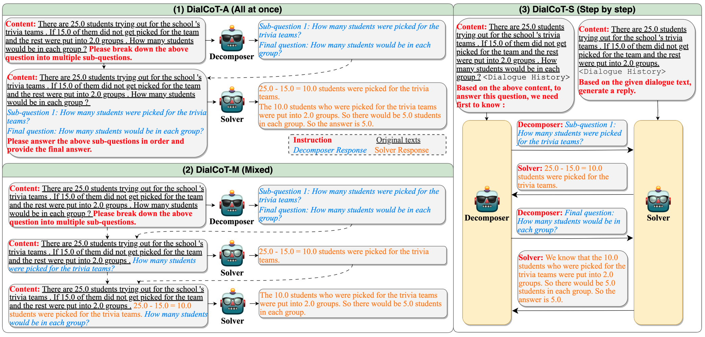

# DialCoT

This is the official repository for the ACL 2023 paper "DialCoT Meets PPO: Decomposing and Exploring Reasoning Paths in Smaller Language Models"

To further boost the reasoning capabilities of SLMs,
we propose **Dial**ogue-guided **C**hain-**o**f-**T**hought (**DialCoT**),
which aims to progressively generate intermediate reasoning steps
in the dialogue format, 
instead of generating all intermediate reasoning steps at once.
Specifically, we assign to the model two roles:
*Decomposer* and *Solver*. 
The *Decomposer* is tasked with 
breaking down the original question into a series of sub-questions.
The *Solver* sequentially addresses each sub-question presented by the *Decomposer*, 
thereby obtaining the answer to the original question.
They utilize different instructions 
while sharing the same model parameters.



We propose three different forms of DialCoT:
1) **DialCoT-A** (**A**ll at once), 
in which the Decomposer generates all sub-questions at once
and the Solver simultaneously provides all answers. 
2) **DialCoT-M** (**M**ixed),
where the Decomposer generates all sub-questions at once
but the Solver sequentially delivers the answers
of the sub-questions generated by the Decomposer.
3) **DialCoT-S** (**S**tep by step),
where both the Decomposer and Solver 
operate sequentially to generate sub-questions and their corresponding answers.


Furthermore,
building upon DialCoT-S,
we design **DialCoT-S-PPO**,
which leverages the **P**roximal **P**olicy **O**ptimization algorithm 
to select the optimal reasoning path,
thereby further enhancing its performance in reasoning tasks.

## Enviroment

You need to clone our project：
```
git clone https://github.com/hccngu/DialCoT.git
```

Create the environment and download the packages

```
conda create -n LiveChat python==3.8
conda activate DialCoT
pip install -r requirements.txt
```

## Train
Please modify the configuration in the `run_train.sh` file and execute the script using the following command.

```
sh run_train.sh
```
If you wish to run PPO, please modify the `run_PPO.sh` file and execute the script using the following command.
```
sh run_PPO.sh
```

## Inference
```
python inference.py --model_path_decom <model path> --test_dataset gsm8k --prompt_type docom3
```
If you wish to perform inference using DialCoT-S-PPO, please modify the configuration and run:
```
sh run_PPO_inference.sh
```

## Citation
If you found this repository is helpful, please cite our paper:
```
@misc{han2023dialcot,
      title={DialCoT Meets PPO: Decomposing and Exploring Reasoning Paths in Smaller Language Models}, 
      author={Chengcheng Han and Xiaowei Du and Che Zhang and Yixin Lian and Xiang Li and Ming Gao and Baoyuan Wang},
      year={2023},
      eprint={2310.05074},
      archivePrefix={arXiv},
      primaryClass={cs.CL}
}
```


## Attribution
Parts of this code are based on the following repositories:
- [flan-alpaca]()
- [Alpaca-CoT]()
- [Special-T5]()
- [PPO]()
- [gym]()